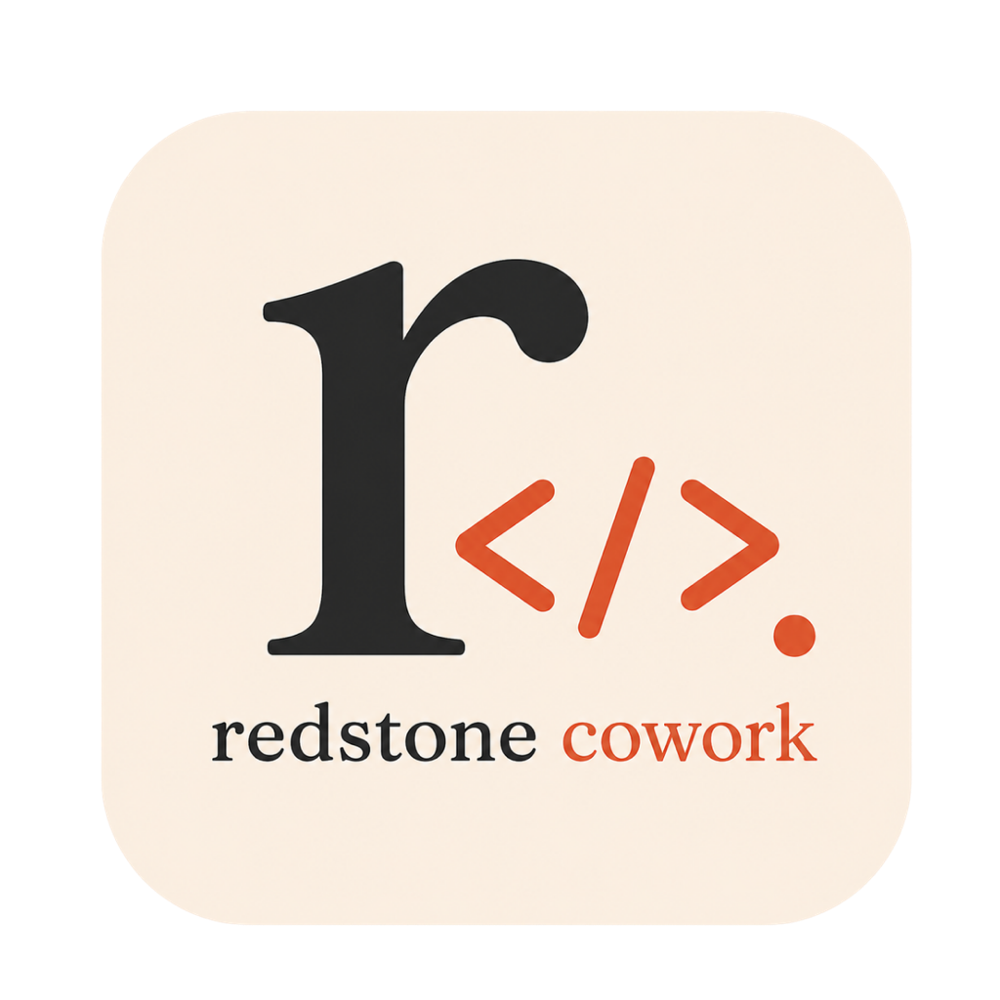

<div align="center">



# Redstone Cowork

**One calm cockpit for every Claude Code session you're running — on any machine.**

[](https://github.com/ngocanhnckh/redstone-cowork/releases/latest)
[](LICENSE)


</div>

---

Your Claude Code sessions run wherever you code — laptops, VPSes, dev servers. Redstone
Cowork is a **self-hosted control plane** that gathers them all into a single cockpit, so
you can see what each one is doing, jump on the ones that need an answer, and reply — from
your desktop or your phone — **without SSH-ing into every box**.

When a session finishes or asks a question, it lands in a **waiting queue that auto-advances**:
answer one, and you're dropped onto the next that needs you. Multitasking across a dozen
agents stops leaking dead time.

> Self-hosted · single user per instance · Docker · uses **your own** Claude subscription.

<div align="center">

<!-- Add a clean demo capture here (no real usernames/clients/IPs):
     save it as docs/assets/cockpit.png and it renders below. -->
<!--  -->

</div>

## Why

Running many coding agents at once is a coordination problem, not a coding problem. You lose
time to *"is it done? is it stuck? is it waiting on me?"* across terminals you have to go
find. Cowork turns that scattered attention into one prioritized surface:

- **See everything at a glance** — every session, its status (working / waiting / idle), a
  live one-line summary, and its current plan.
- **Answer where you are** — a single queue that auto-advances, so you clear the backlog
  instead of hunting for it. Reply from desktop, browser, or phone.
- **Reach into any session** — a live terminal, an in-app browser, an editable file tree,
  port forwarding, and host telemetry — all proxied through the server, so mobile and web
  are first-class.

## Features

| | |
|---|---|
| 🧭 **Waiting queue, auto-advanced** | Sessions that need you are ranked and surfaced; answering one jumps to the next. Skip, snooze, or pin. |
| 💬 **Full session view** | Transcript + custom reply, with Claude's mode at a glance (Default / Accept Edits / Plan / Auto) and a live context meter. |
| 🖥️ **Live terminal** | A real PTY into each session's host — local or over SSH — right in the cockpit. |
| 🌐 **In-app browser** | Preview a session's web app, with **point-and-prompt** tools: click an element or drag a screenshot region and send it back to the agent as precise, contextual feedback. |
| 📁 **Editable file browser** | Browse and edit files on the session's machine, with fast remote listing, streaming search, and previews. |
| 🔌 **Port forwarding** | Reach a session's `localhost:PORT` services directly, via an SSH fast-lane or the server proxy. |
| 📊 **Host telemetry** | Live CPU / RAM per machine, so you know what each host is doing. |
| ⚡ **Skills & Commands palette** | Every Claude Code slash-command and skill across all your hosts, searchable in one place. |
| 🪟 **Flow · Grid · HUD** | Focus one session, tile many, or drop into a transparent desktop HUD that floats over your work. |
| 🎨 **Liquid-glass UI** | A warm-ink, frosted-glass interface — tune blur, tint, glass, and dock, or make it see-through over your desktop. |
| 🔔 **Notifications** | Get pinged the moment a background session finishes or needs a decision. |

## Install the server

One line on any Linux VPS — it picks a free port pair (asking you to confirm), generates your
login token, and brings the stack up:

```bash
curl -fsSL https://raw.githubusercontent.com/ngocanhnckh/redstone-cowork/main/install.sh | bash
```

It installs Docker if needed, clones the repo, scans for a **free, uncommon** host-port pair,
generates a unique instance token + database password, starts the containers, and prints your
**URL** and **login token**. Sign in at `http://<server-ip>:<web_port>` with that token — it
*is* your password, so keep it secret. For a public HTTPS address, point a reverse proxy or a
Cloudflare tunnel at the web port.

Re-running the installer leaves an existing `.env` (ports + token) untouched. Manage the stack
with `cd ~/redstone-cowork && docker compose {ps,logs,down}`. Env knobs: `RCW_DIR`,
`RCW_BRANCH`, `RCW_REPO_URL`.

## Get the desktop app

Download the cockpit for **macOS**, **Windows**, or **Linux** from the
[**latest release**](https://github.com/ngocanhnckh/redstone-cowork/releases/latest):

| Platform | File |
|----------|------|
| macOS    | `Redstone Cowork-<version>-arm64.dmg` (or `.zip`) |
| Windows  | `Redstone Cowork-<version>-Setup.exe` |
| Linux    | `.AppImage` or `.deb` |

Builds are unsigned, so the first launch needs a one-time bypass: on macOS right-click →
**Open**; on Windows click **More info → Run anyway**. Point the app at your server URL and
sign in with the same instance token.

## Connect a machine

To make a machine's Claude Code sessions show up in the cockpit, run the Redstone agent on it
(it reports sessions + host telemetry and relays your answers back). See
[`docs/prd/006-deployment.md`](docs/prd/006-deployment.md) and the enrollment flow in the app's
**Settings → Hosts**.

## How it works

```
  Claude Code sessions            Redstone Cowork server              You
  (any host, via the agent)   ──▶  (apps/api + apps/web)      ◀──▶   desktop · browser · phone
   sessions · terminals · files    queue · summaries · vault
   ports · telemetry               file/port proxy · bridge
```

- **`apps/api`** — the hub: sessions, decisions, the waiting queue, summaries, credential
  vault, file/port proxy, host telemetry, and the agent bridge.
- **`apps/web`** — Next.js server the desktop and browser talk through.
- **`apps/worker`** — background jobs / heartbeats.
- **`apps/desktop`** — the Electron cockpit (shared React renderer).
- **Postgres + Qdrant** — persistence and vector store.

Hexagonal API (domain ports → use cases → adapters), shared Zod types in `packages/shared`,
prompts as Jinja templates under `prompts/`. Conventions live in [`CLAUDE.md`](CLAUDE.md).

## Build from source

The desktop app needs only **Node 22 + pnpm** — no C++ toolchain (its one native dependency,
`node-pty`, ships prebuilt binaries). You can even cross-build a Windows installer from macOS.
Full instructions, including cross-building, are in [**docs/BUILD.md**](docs/BUILD.md).

```bash
pnpm install
pnpm --filter @rcw/desktop dev   # run the cockpit against a server
pnpm test                        # all packages (Vitest)
```

## Contributing

Issues and PRs welcome. Please keep changes focused, follow the conventions in
[`CLAUDE.md`](CLAUDE.md), and add tests for behavior-bearing code (the suite is Vitest;
`pnpm test` at the root). Conventional commits (`feat(api): …`, `fix(desktop): …`).

## Docs

- [Building the desktop app](docs/BUILD.md)
- [Project plan & milestones](docs/PLAN.md)
- [Deployment](docs/prd/006-deployment.md)
- [Vision / history](docs/ABOUT.md) *(pre-pivot, kept for context)*

## License

[MIT](LICENSE) © Redstone Cowork
